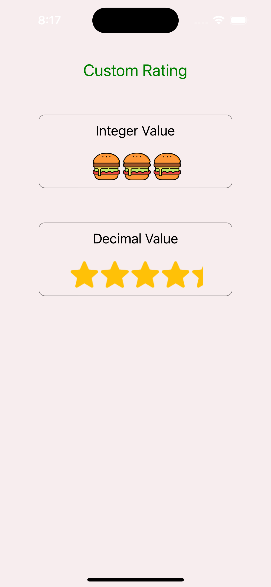

# rn-ratings
<br>

<p align="center">


</p>

<br>

## Features ✨

- Custom icon rating
- Supports decimal value
- Highly customizable
- No dependency
- Regularly maintained
 


## Rating Demo
<br>
<div style="flex-direction: row" align="center" >
  
</div>

<br>
<br>

## Installation

Install the package using yarn or npm:

```yarn add rn-ratings```

  OR
  
```npm install rn-ratings```

## Usage

<br>

``` js
import Rating from 'rn-ratings';


const App = () => {
  return (
    <View style={{flex: 1}}>
      <Rating
        source={require('./src/assets/image/png/burger.png')}
        rating={3}
      />
    </View>
  );
};

export default App;
```

<br>

### RatingProps

| prop | default | type | description |
| ---- | ---- | ----| ---- |
| rating | 5 | number |  Total number of ratings to display |
| source | none | string / path | Pass in a custom image source |
| containerStyle | none | object / Stylesheet | Custom style applied to outermost container |
| iconContainerStyle | none | object / Stylesheet | Custom style applied to icon container |
| imageStyle | none | string | Custom style for rating icon|


<br>

## Feedback

This repo is being actively manitained. Feel free to open a new Issue with a `Feature Request` or submit a PR with an `Enhancement`.


<br>
<br>

<a href="https://www.buymeacoffee.com/mxheepsingh" target="_blank"></a>